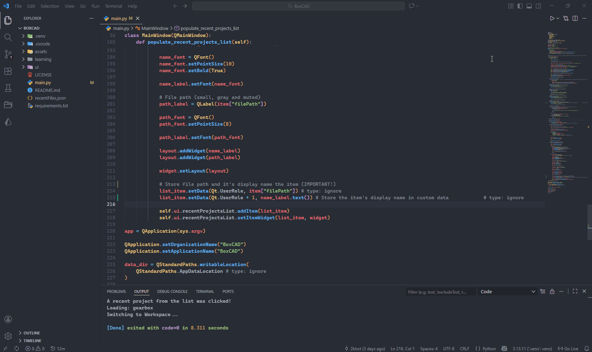

# BoxCAD 📦  
## A Parametric Enclosure Designer for Makers

**BoxCAD** is a lightweight, Python-powered desktop application for designing custom, 3D-printable project enclosures. Instead of manually modeling simple boxes in CAD software, you define dimensions and hardware presets, preview the result in real time, and export directly for manufacturing.

The goal is speed, repeatability, and clean parametric control — especially for electronics projects.

---

## ✨ Key Features

- **True Parametric Design**  
  Adjust length, width, height, and wall thickness. All dependent features — lids, screw holes, offsets — update automatically.

- **Hardware Presets**  
  Built-in footprints for popular boards such as Arduino Uno, ESP32, and Raspberry Pi simplify mounting and alignment.

- **Real-time 3D Preview**  
  An OpenGL-accelerated viewport lets you instantly visualize changes as you tweak parameters.

- **Manufacturing Ready**  
  Export clean `.STL` files suitable for direct 3D printing.

---

## 🛠️ Built With

BoxCAD is built entirely in Python using modern, well-supported libraries:

- **Python 3.14.2**
- **PySide6** – Native-looking cross-platform GUI
- **CadQuery** – Industrial-grade parametric geometry kernel
- **PyQtGraph** – High-performance 3D visualization

---

## 🚀 Getting Started

### 1. Prerequisites

- **Python 3.14.2**  
  Make sure Python is installed and available in your system PATH.

- **Virtual Environment**  
  It is strongly recommended to use a virtual environment to avoid dependency conflicts.

Create one in the directory where you cloned the repository:

```bash
python -m venv .venv
```

Once the virtual environment is created, activate it using the instructions below for your operating system.

<details>
<summary><strong>Windows</strong></summary>

Activate the virtual environment:

```bash
.venv\Scripts\activate
```

</details>

<details>
<summary><strong>macOS, Linux, and WSL</strong></summary>

Activate the virtual environment:

```bash
source .venv/bin/activate
```

</details>

---

### 2. Installation

Install all required dependencies using `pip`:

```bash
pip install -r requirements.txt
```

This will install all libraries needed to run BoxCAD.

---

### 3. Usage

Start the application by running:

```bash
python main.py
```

The welcome window will open, in which you can create a project, browse the hardware library and watch tutorials.

---

## 🏞️ Short demo GIF
Below is a short GIF showing the functionality so far.


## 📄 License

This project uses the *MIT License*. You can learn more about it [here](https://github.com/2k-lxst/BoxCAD/blob/main/LICENSE).
