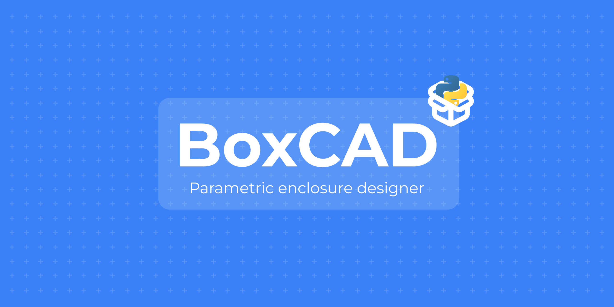

# BoxCAD 📦
## The Parametric Enclosure Designer for Makers.

BoxCAD is a lightweight, Python-powered desktop application that allows you to design custom 3D-printable enclosures simply by entering dimensions. No more manual 3D modeling for simple project boxes - just input your parameters, select your hardware preset, and export.

# ✨ Key Features

- True Parametric Design: Adjust Length, Width, Height, and Thickness; all other components (lids, screw holes, offsets) update automatically.

- Hardware Presets: Integrated footprints for popular boards like Arduino Uno, ESP32, and Raspberry Pi.

- Real-time 3D Preview: Visualize your enclosure instantly using an OpenGL-accelerated viewport.

- Manufacturing Ready: Export directly to .STL for 3D printing.

# 🛠️ Built With

- Python 3.14.2

PySide6: For the modern, native-feeling GUI.

CadQuery: The powerful industrial-grade geometric kernel.

PyQtGraph: For high-performance 3D visualization.

# 🚀 Getting Started
## 1. Prerequisites
Ensure you have Python 3.14.2 installed, then set up a virtual environment:

```bash
python -m venv venv
```

<details>
	<summary>Windows</summary>

	```bash
	venv\Scripts\activate
	```
</details>

<details>
	<summary>MacOS, Linux, WSL</summary>

	```bash
	source venv/bin/activate 
	```
</details>

## 2. Installation

```bash
pip install -r requirements.txt
```

## 3. Usage

```bash
python main.py
```
